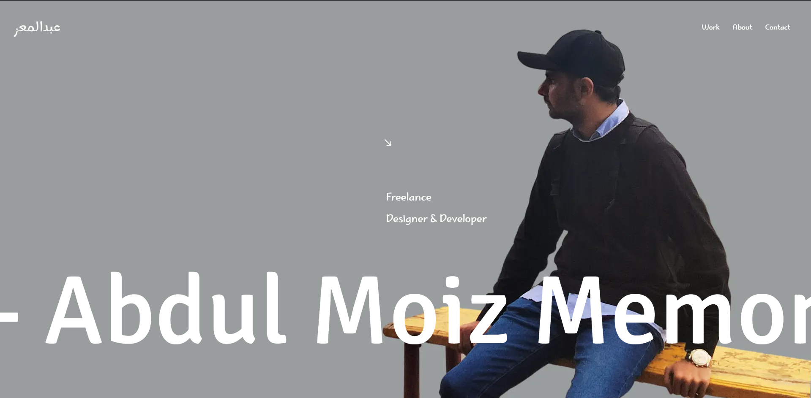

# 🚀 Personal Portfolio - Abdul Moiz Memon  

Welcome to the repository for my personal portfolio website! This project showcases my skills, experience, and projects in a dynamic and visually captivating way.  



## 🛠️ Built With  
This portfolio is built with modern tools and libraries to ensure a seamless user experience and engaging design:  
- **[Next.js](https://nextjs.org/):** React framework for server-rendered and static websites.  
- **[React](https://reactjs.org/):** JavaScript library for building user interfaces.  
- **[Three.js](https://threejs.org/):** For creating stunning 3D visuals.  
- **[GSAP](https://greensock.com/gsap/):** High-performance animation library for interactive elements.  
- **[Framer Motion](https://www.framer.com/motion/):** Animation library for React.  
- **[Locomotive Scroll](https://locomotivemtl.github.io/locomotive-scroll/):** Smooth scrolling and parallax effects.  
- **[Sass](https://sass-lang.com/):** CSS preprocessor for styling.  
- **[Vercel](https://vercel.com/):** Platform for hosting and deploying the website.
- **[Web3Forms](https://web3forms.com/):** Form submission backend for the contact form. 

## 🎨 UI/UX Inspiration  
Most of the UI/UX design is inspired by the brilliant work on [Dennissnellenberg.com](https://www.dennissnellenberg.com).  

## 🌟 Features  
- Interactive and responsive design.  
- Smooth animations and transitions.  
- Optimized for both desktop and mobile devices.  
- Projects showcase with detailed descriptions and visuals.  

## 🚧 Getting Started  
Follow these steps to set up the project locally:  

### Prerequisites  
Make sure you have the following installed:  
- Node.js (v22 or later)  
- npm or yarn  

### Installation  
1. Clone the repository:  
   ```bash  
   git clone https://github.com/moiz98/portfolio-website.git  
2. Navigate to the project directory:
    ```bash
    cd portfolio-website  
3. Install dependencies:
    ```bash
    npm install  
    # or  
    yarn install  
4. Start the development server:
    ```bash
    npm run dev  
    # or  
    yarn dev  
5. Open your browser and visit http://localhost:3000 to view the site.

📝 License

This project is licensed under the MIT License. Feel free to use it as a reference or inspiration for your own portfolio!

💡 Feedback

If you have any feedback or suggestions, feel free to open an issue or reach out to me via the contact section on my portfolio.

📬 Contact

Explore the live website here: itsmemoiz.me
